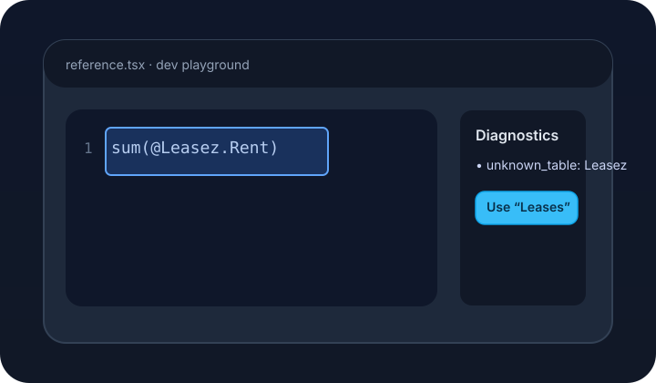
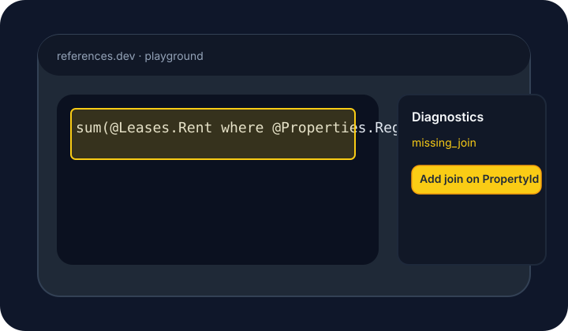

# Reference quickstart

References are the structured expressions that tell Astalla which data you want to analyse. They combine a **canonical** syntax that the runtime executes with **humanized** phrases that product surfaces can show to end users. This guide walks you through the mental model, provides copy‑and‑paste examples, and shows how to resolve the most common diagnostics.

## Canonical versus humanized references

- **Canonical references** always start with `@`, use the real table and column names from your workspace schema, and can include `where` clauses to filter rows. Canonical expressions are unambiguous and are what the engine executes.
- **Humanized references** describe the same intent using natural language. They are easier to read aloud, can include synonyms, and are translated back into canonical form with the humanizer. Humanized strings are great for prompts, chat replies, or anywhere you want the assistant to “speak human.”

A good workflow is to design the canonical expression first, verify that it runs, and then store the humanized version next to it for UI copy.

## Copy‑and‑paste examples

The following snippets all work against the demo schema that ships with the dev playground. Each row shows the humanized phrasing next to its canonical counterpart so you can grab whichever you need.

| Humanized | Canonical |
| --- | --- |
| "Average rent in Lakeside where the lease is active" | `avg(@Leases.Rent where @Properties.Name = 'Lakeside' and @Leases.Status = 'active')` |
| "Total rent collected for North region leases" | `sum(@Leases.Rent where @Properties.Region = 'North')` |
| "Count of portal leads created this quarter" | `count(@Leads.Id where @Leads.Source = 'Portal' and @Leads.CreatedAt >= '2024-04-01')` |
| "Average approval time for applications" | `avg(@Applications.DecisionSeconds)` |
| "Maximum rent for renewals" | `max(@Leases.Rent where @Leases.Status = 'renewed')` |
| "Minimum rent for downtown properties" | `min(@Leases.Rent where @Properties.Region = 'Downtown')` |
| "Count of leases ending next month" | `count(@Leases.Id where @Leases.EndDate between '2024-11-01' and '2024-11-30')` |
| "Total marketing cost for social leads" | `sum(@Leads.Cost where @Leads.Source = 'Social')` |
| "Average tour-to-lease conversion" | `avg(@Leads.TourToLeaseRatio)` |
| "Count of leases with approved applications" | `count(@Leases.Id where @Applications.Status = 'approved')` |

> 💡 **Tip:** Drop these snippets straight into the expression editor on the dev demo page. The autocomplete will fill in table and column names as you type, and the diagnostics panel will suggest quick fixes when something looks off.

## Troubleshooting diagnostics

When something is wrong in your expression, the diagnostics panel flags it with a short message, an error range, and—when possible—a one-click fix. The screenshots below show the most common situations and how to resolve them.

### Unknown table or column

An `unknown_table` or `unknown_column` diagnostic appears when a name does not exist in your schema. The quick fix suggests the closest match so you do not have to retype it.

1. Accept the suggested fix or manually update the table/column name.
2. Re-run the expression to confirm the diagnostic disappears.

### Missing join

A `missing_join` warning indicates that the filter references another table without a path that links it to the base table. Add the appropriate join column (for example, filter on `@Leases.PropertyId` before referencing `@Properties.Region`).

1. Click **Add join on PropertyId** (or the relevant column) in the quick fix menu.
2. Re-run the expression so the assistant can follow the relationship path.

### Type mismatch

A `type_mismatch` error pops up when you call an aggregation that is not compatible with the selected column type. Switch the function to one of the allowed aggregations suggested by the quick fix.

1. Choose the proposed aggregation or manually enter one that matches the column type.
2. Re-run the expression to verify the diagnostic no longer appears.

Once the diagnostics panel is clear, you are ready to promote the reference from the dev playground into production workflows.
